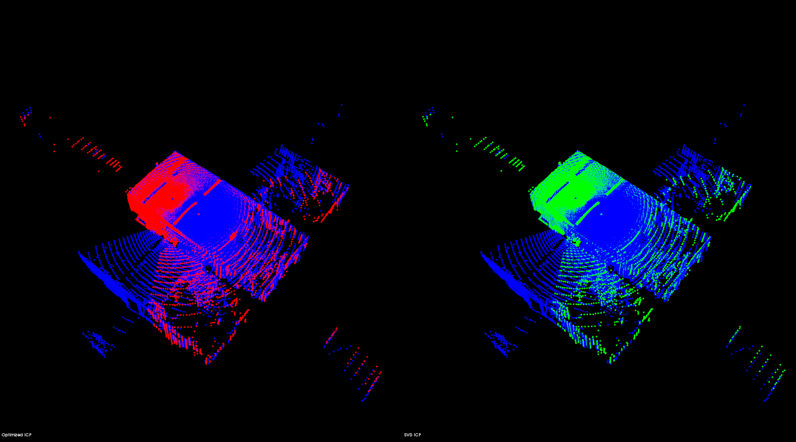

## 1. 依赖库

```shell
sudo apt-get install libpcl-dev
sudo apt-get install libeigen3-dev
```

## 2. 编译与运行

```shell
# 编译
cd optimized_ICP
mkdir build
cd build
cmake ..
make -j4

# 运行
./optimized_icp
```

## 3. 效果



## 4. 算法细节

具体推导过程请参考我的博客
[【附优化方法的ICP源码】ICP与NDT匹配算法精度对比，以及手动实现的ICP和基于优化方法的ICP精度对比
](https://blog.csdn.net/u011341856/article/details/110210533)
